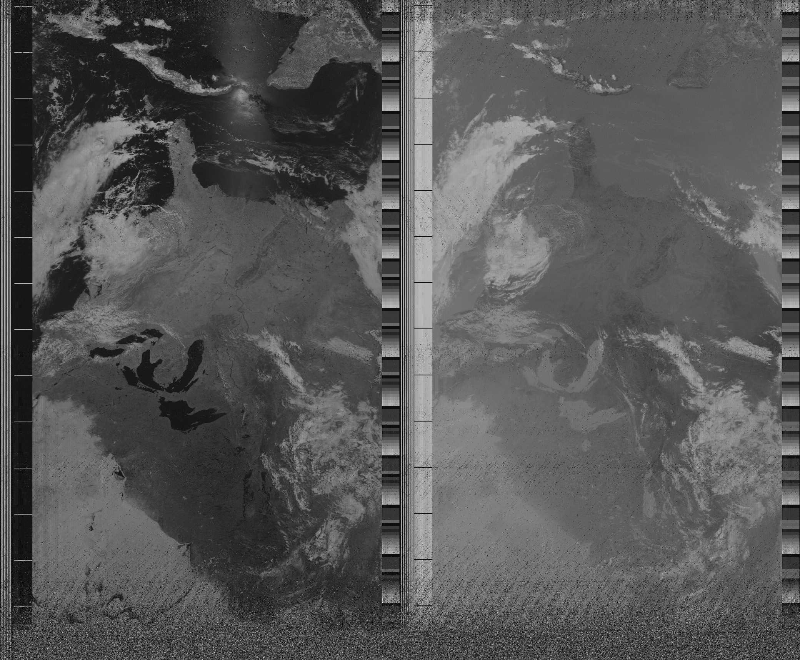

# noaa-apt

NOAA APT image decoder.

Doesn't do anything special, takes a recorded WAV file (from GQRX, SDR#, etc.)
and decodes the raw image. Later you can rotate the image and adjust the
contrast with something like GIMP or Photoshop.

Written in Rust, never tried to do signal processing or to use Rust before, but
it works quite well. Works with WAV files of any sample rate.

## Usage

```
$ ./noaa-apt --help

Usage:
    ./target/release/noaa-apt [OPTIONS] INPUT_FILENAME

Decode NOAA APT images from WAV files.

positional arguments:
  input_filename        Input WAV file.

optional arguments:
  -h,--help             show this help message and exit
  -d,--debug            Print debugging messages.
  -q,--quiet            Don't print info messages.
  -o,--output FILENAME  Set output path. When decoding images the default is
                        './output.png', when resampling the default is
                        './output.wav'.
  -r,--resample SAMPLE_RATE
                        Resample WAV file to a given sample rate, no APT image
                        will be decoded.
```

## Example

From a WAV file I found lying around:



## Alternatives

Just bought an RTL-SDR and tried to receive NOAA APT images, I'm new to this but
as of August 2018:

- [WXtoImg], by far the most popular, lots of features but the site looks dead
  forever.

- [WXtoImg Restored], unofficial mirror with installers recovered by users.

- [atp-dec/apt-dec], works really good. Keep in mind that the [1.7 release]
  looks newer than the [repo's master branch]. I tried several times to compile
  the [repo's master branch] without success, later I realized that there was a
  newer [1.7 release] and it worked.

- [zacstewart/apt-decoder], written in Python, slower than the others but really
  simple. Doesn't align the image to the sync stripes.

- [martinber/apt-decoder], bad hack made by me on top of
  [zacstewart/apt-decoder] trying to align the image to the sync stripes. Still
  slow and minor artifacts on the image if you look at the vertical stripes.

[WXtoImg]: http://wxtoimg.com/
[WXtoImg Restored]: https://wxtoimgrestored.xyz/
[atp-dec/apt-dec]: https://github.com/csete/aptdec
[1.7 release]: https://github.com/csete/aptdec/releases
[repo's master branch]: https://github.com/csete/aptdec
[zacstewart/apt-decoder]: https://github.com/zacstewart/apt-decoder
[martinber/apt-decoder]: https://github.com/martinber/apt-decoder

## Dependencies

- GNU Scientific Library:

  - Compiling: `sudo apt install libgsl0-dev`.
  - Running: `sudo apt install libgsl0`.

## Things I should do

- Set version number when it's barely ready.

- Support Windows and make some simple GUI.

- Drop the GSL dependency because I guess that it's cumbersome to install in
  Windows. I'm using only a Bessel function. Maybe compile a "no GSL" version
  with some predefined filters, which works only with a few sample rates.

- The parameters used for filter design are hardcoded


## Algorithm

AM resampling and demodulation using FIR filter, following method 4 or 5 in
reference [1]:

- Load samples from WAV.

- Resample to a intermediate sample rate: 20800Hz.

  - Get L (interpolation factor) and M (decimation factor) by looking at the
    greatest common divisor (GCD) between input and output sample rates.

  - Get interpolating lowpass filter inpulse response by window method.

    - Get kaiser window.

    - Sample and window the function `sin(n*cutout)/(n*pi)`.

  - Do the equivalent of:

    - Insertion of L-1 zeros between samples.

    - Filter by doing the convolution with the impulse response.

    - Decimate by M.

- Demodulate AM signal yo get the APT signal.

  - Get hilbert filter impulse response by window method.

    - Get kaiser window.

    - Sample and window the function `1/(pi*n) * (1-cos(pi*n))`.

  - Get the imaginary part of the Analytical Signal by doing the convolution
    with the hilbert impulse response. This part adds a delay (maybe I should
    fix that).

  - Get the real part of the Analytical Signal by adding the same delay to the
    original AM signal.

  - Calculate the absolute value of each sample: `sqrt(real^2 + imag^2)`.

- Find the position of the sync frames of the APT signal (the white and black
  stripes that you can see in the final image).

  - Calculate the cross correlation between a hardcoded sync frame and the APT
    signal.

  - The peaks of that cross correlation show the locations of the sync frames in
    the APT signal.

- Map the values of the signal to numbers between 0 and 255.

- Generate the final image starting a new line on every sync frame.

## Resampling algorithm

I did something like what you can see
[here](https://ccrma.stanford.edu/~jos/resample/).

## Notes

```

- Looks like there are several definitions for Kaiser window values, I get
  different results compared to Matlab.

- I use 32 bit float and integers because it's enough?.

  NOAA 15:
  NOAA 
  NOAA 18: 137.9125MHz

  Portadora AM: 2400Hz
  Amplitud: Escala de grises

  Cada palabra es 8 bits/pixel
  Dos lineas por segundo.
  4160 words/segundo.
  909 words utiles por linea
  Cada linea contiene las dos imagenes
  2080 pixeles/linea

  Cosas por línea:

  - Sync A: Onda cuadrada de 7 ciclos a 1040Hz
  - Space A:
  - Image A:
  - Telemetry A:
  - Sync B: Tren de pulsos de 842 de 7 ciclos????
  - Space B:
  - Image B:
  - Telemetry B:

  Procedimiento:

  - WAV a 11025Hz
  - Filtro pasa bajos
  - Resampleo a 9600Hz (4 veces más que la AM a 2400Hz)
  - Quedan 4 muestras por word de la AM de 2400Hz, cada muestra a 90 grados de
    diferencia de fase
  - Convierte a complejo y toma el módulo
  - Resampleo a 4160

```

## References

- [Digital Envelope Detection: The Good, the Bad, and the Ugly][1]: Lists some
  AM demodulation methods.

- [Hilbert Transform Design Example][2]: How to get the analytic signal.

- [Spectral Audio Signal Processing: Digital Audio Resampling][3].

- [Impulse Response of a Hilbert Transformer][4].

- [Spectral Audio Signal Processing: Kaiser Window][5].

- [How to Create a Configurable Filter Using a Kaiser Window][6],

[1]: https://www.dsprelated.com/showarticle/938.php
[2]: https://www.dsprelated.com/freebooks/sasp/Hilbert_Transform_Design_Example.html
[3]: https://ccrma.stanford.edu/~jos/resample/
[4]: https://flylib.com/books/en/2.729.1/impulse_response_of_a_hilbert_transformer.html
[5]: https://ccrma.stanford.edu/~jos/sasp/Kaiser_Window.html
[6]: https://tomroelandts.com/articles/how-to-create-a-configurable-filter-using-a-kaiser-window

[analytic signal]: https://en.wikipedia.org/wiki/Analytic_signal
